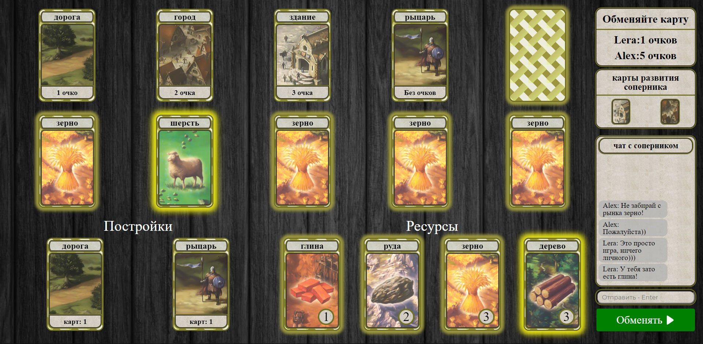

# [Начать игру!](http://catan-card-game.herokuapp.com)

## О проекте
Карточная версия игры Колонизаторы с возможностью создания игровой комнаты для 2-х игроков.
Групповой проект. Создан с целью закрепления изученных технологий.

## Изображения

  
  
  

## Авторы 

- [Вадим Кривошеин](https://github.com/VSKrivoshein)
- [Артём Шилов](https://github.com/ArtShilov)
- [Вячеслав Пышкин](https://github.com/SlavaPush)

## Используемый стек технологий

- React 
- Redux + Saga
- Styled components
- Express
- MongoDB (Mongoose)
- WebSocket

